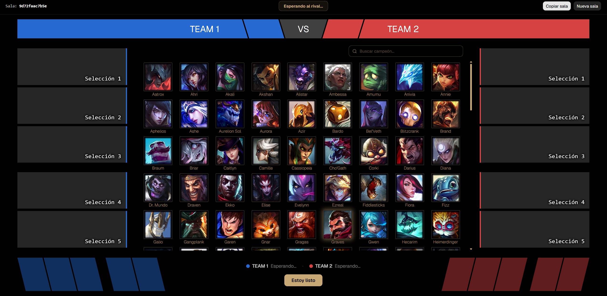
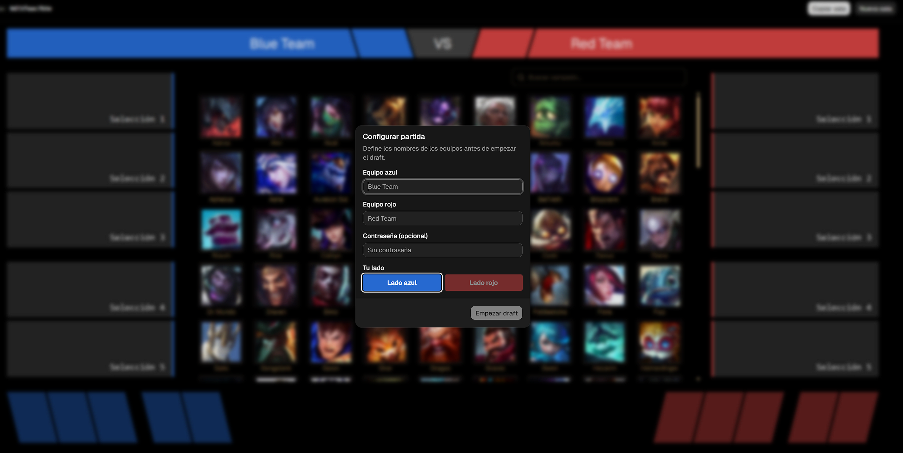

# DraftLab

Simulador de pick & ban en tiempo real para League of Legends, creado pensando
en replicar el draft del competitivo con el diseño antiguo, el que se usaba
aproximadamente entre la season 6 y la season 10.

La idea es jugar el draft como en un partido de equipo: un lado azul contra un
lado rojo, con un capitán por lado que banea y elige los campeones por su
equipo.



## Características

- Modo en equipo, lado azul contra lado rojo.
- Un capitán por lado: cada capitán banea y pickea por su equipo.
- Creación de drafts por salas: cada partida vive en su propia URL y se comparte
  como un enlace. La sala puede ser pública o privada con contraseña, y al
  crearla eliges tu lado (azul o rojo).
- Usa las reglas del draft competitivo (secuencia de bans y picks por turnos,
  con cronómetro por turno).
- Reordenamiento de líneas en la fase final: como hay un capitán por lado, al
  terminar el draft el capitán acomoda sus picks en cada línea (top, jungla,
  mid, bot, support) arrastrando y soltando.

Al crear la sala se configuran los equipos, la contraseña y el lado:



## Tecnologías

- React 19, TypeScript y Vite
- PartyKit (WebSockets sobre Cloudflare) para el tiempo real
- Tailwind CSS v4 y shadcn/ui para la interfaz
- @dnd-kit para el arrastrar y soltar
- Data Dragon de Riot Games como fuente de campeones

## Cómo funciona

El servidor es la única fuente de verdad. Los clientes no deciden nada por su
cuenta: mandan intenciones ("quiero banear a X") y el servidor valida si es
válido, aplica el cambio y reparte el nuevo estado a todos. Así nadie puede
hacer trampa y todos ven lo mismo, incluso al recargar la página.

## Correr en local

Necesitas Node y pnpm.

```bash
pnpm install
```

```bash
# terminal 1 - el servidor en tiempo real
pnpm party

# terminal 2 - la app
pnpm dev
```

Abre la URL que muestra Vite. Para probar el multijugador, abre la misma sala
en dos pestañas (una en incógnito sirve como segundo jugador).

## Despliegue

Los pasos para publicarlo están en [DEPLOY.md](./DEPLOY.md).

## Estado

En desarrollo. Funciona de extremo a extremo en local; el hosting está
pendiente. La base ya está lista para sumar más juegos además de LoL.
